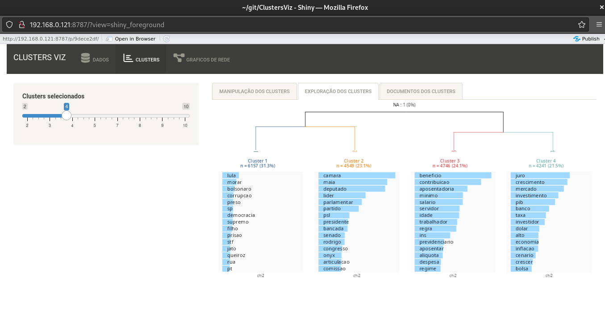
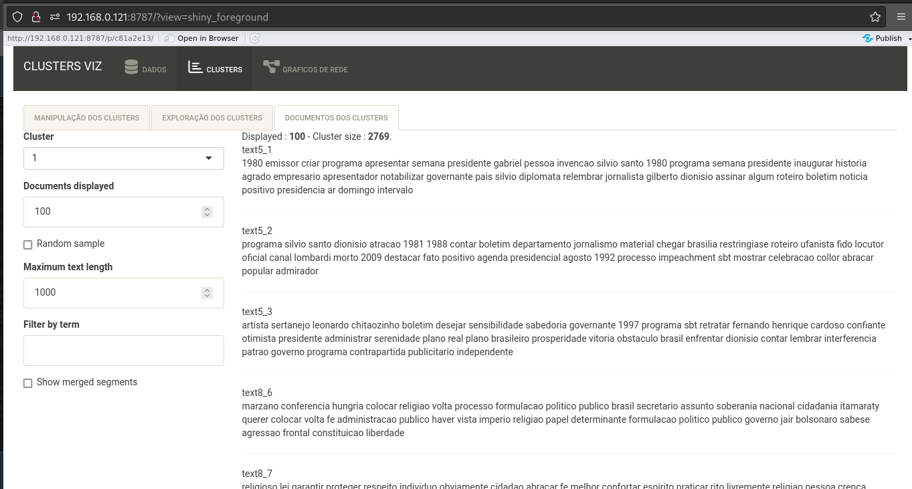
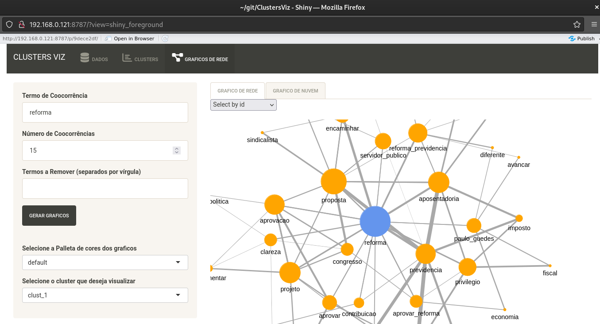
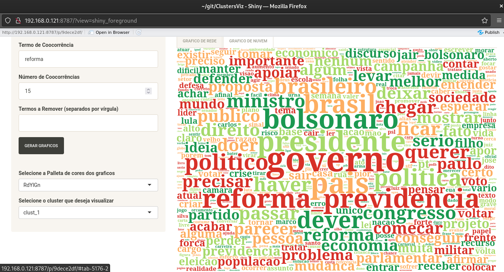

# ClustersViz

O ClustersViz é uma sistematização em shiny criada para auxliar os analistas na produção/reprodução de dados de corpus.

## Features:

-   Clusterização Hierarquica:



-   Visualização do texto:



-   Visualizações de Rede:



-   Nuvens de palavras:



## Como instalar ?

-   Instalando o pacote pelo ambiente R:

```{r}

# Utilizando o devtools:
devtools::install_github("kaiorb52/ClustersViz")

# Utilizando o remotes:
remotes::install_github("kaiorb52/ClustersViz")

```

-   Clonando o repositorio do pacote pelo Git:

```         
git clone https://github.com/kaiorb52/ClustersViz.git
```

## Como Rodar o ClustersViz ?

-   Caso o pacote ClustersViz esteja instalado na maquina:

```{r}
library(ClustersViz)

ClusterViz()

# Ou

ClustersViz::ClusterViz()
```

-   Caso tenha o repositorio do github clonado:

    -   Rode o arquivo: "test/test.R"


## Specs:

A aplicação foi feita no R 4.4.1 e nos OS:

-   Windows 10

-   Ubuntu 24.04.1 LTS

-   Debian GNU/Linux 12 (bookworm)

Recomenda-se utilizar o ClusterViz em um computador pessoal, das seguintes configurações:

-   Intel I5

-   8gb ram


## Notas:

-   Em caso de erro nos graficos de rede:

    -   Reiniciar seção R, ou

    -   Fechar pacotes, reativar ClustersViz
